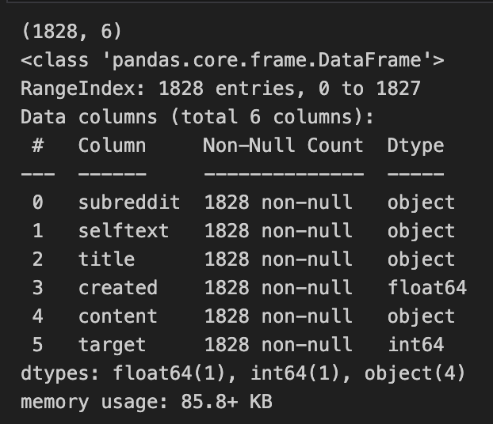
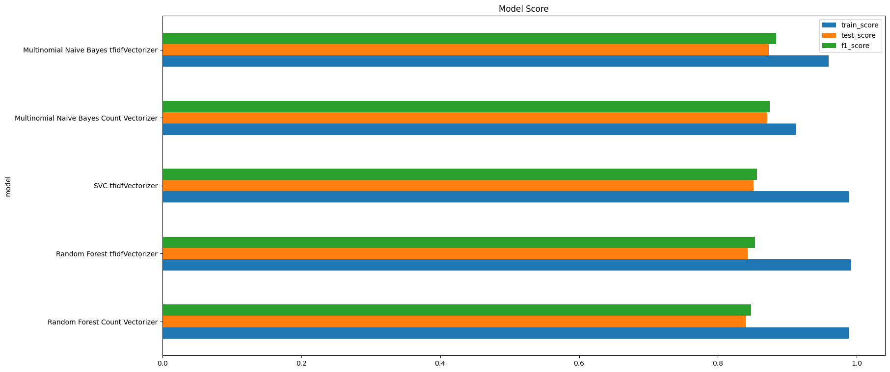
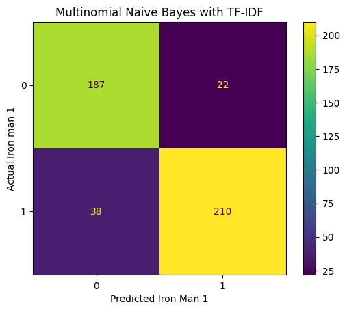

# Project 3 Who is BatIronMan

## **Problem Statement**
The Goal of this project is to find distinct IronMan from Batman
which their both have similarity in many aspect Richman save people
- their both have hi-tech car, rich, and be a man
- their both distinct in wearable just iron man wear iron suit, batman wear pvc suit
- its hard for us to distinct these 2 with subreddit post 
- so out business is serious about split batman from ironman

via subreddit post only text too since image didn't included in this project concern

Success will be evaluate by we can distinct Batman and IronMan from subreddit post `ironman` and `batman` that we mix its and test and we can classify that post is from batman or ironman subreddit

For Ironman's fanclub that need to distinct post so he can follow only ironman not batman 

## **Data Collection**
I create `sub_reddit_post_gathering` to gather post from any subredditwith 3 parameters that can configure
- `subreddit_name`
- `data_amount`
- `output_csv`
so you can collecting data in any sub reddit and any amout you want

but in this case I collected from `ironman`, `batman` for approximately `1_000` posts each 

with these raw columns 
```
approved_at_utc,subreddit,selftext,author_fullname,saved,mod_reason_title,gilded,clicked,title,link_flair_richtext,subreddit_name_prefixed,hidden,pwls,link_flair_css_class,downs,thumbnail_height,top_awarded_type,hide_score,name,quarantine,link_flair_text_color,upvote_ratio,author_flair_background_color,subreddit_type,ups,total_awards_received,media_embed,thumbnail_width,author_flair_template_id,is_original_content,user_reports,secure_media,is_reddit_media_domain,is_meta,category,secure_media_embed,link_flair_text,can_mod_post,score,approved_by,is_created_from_ads_ui,author_premium,thumbnail,edited,author_flair_css_class,author_flair_richtext,gildings,content_categories,is_self,mod_note,created,link_flair_type,wls,removed_by_category,banned_by,author_flair_type,domain,allow_live_comments,selftext_html,likes,suggested_sort,banned_at_utc,view_count,archived,no_follow,is_crosspostable,pinned,over_18,all_awardings,awarders,media_only,can_gild,spoiler,locked,author_flair_text,treatment_tags,visited,removed_by,num_reports,distinguished,subreddit_id,author_is_blocked,mod_reason_by,removal_reason,link_flair_background_color,id,is_robot_indexable,report_reasons,author,discussion_type,num_comments,send_replies,whitelist_status,contest_mode,mod_reports,author_patreon_flair,author_flair_text_color,permalink,parent_whitelist_status,stickied,url,subreddit_subscribers,created_utc,num_crossposts,media,is_video,post_hint,url_overridden_by_dest,preview,link_flair_template_id,is_gallery,media_metadata,gallery_data,crosspost_parent_list,crosspost_parent,author_cakeday
```

as number of post is just 1000 so I didn't throttering anythings 


## **Data Cleaning and EDA**

after explore on raw data I decide to use only `subreddit`, `selftext`, `title`, and `create` to use in data modeling and drop other

after check missing value I decide to migrate 2 columns `selftext`, `title` in to `content`

and remove `bat man`, `iron man` from each data source for data leaked 

also create `my_tokenize` to cleanup `content` and improve by remove `[`, `]` from content in tokenize 

convert `subreddit` into binary `target` column

and merge into 1 data frame 
 


## **Preprocessing and Modeling**
with 2 vectorize and 3 classifier
I use Grid Search to loop through each pipeline to modeling and got these score




## **Evaluation and Conceptual Understanding**


I considering use f1_score in this case since `false_negative` and `false_positive` case didn't much matter but balance is matter more in this case 


## **Conclusion and Recommendations**
after run with 1000 posts for each datasource I try to add more data set with 10,000 posts crawling but I also get approx 3,000 post each 

and run once again with same methods to check if data source matter 
found out that for more data set its make model less over fit and can endure variance better

also for some deep down research for each false posts found that some content is clueless with image and meme so if we can filter out meme or image better also can improve accuracy 

and with some bag words for each focus topics also can help modeling better or modeling with a lot of data set like chatGPT will also help modeling understand some context muchmore